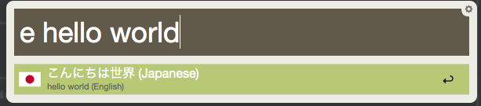
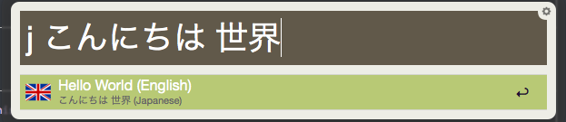

Google Translate For Japanese Alfred Workflow
=============================

Version 2.4.0

## License

The MIT License (MIT)

Copyright (c) 2013-2015 Thomas Hempel <thomas@scriptme.de>

**Thanks to everyone who gave feedback and provided fixes for this Workflow!!! You are awesome!**

### Attention!

_Google changed something in the API. They seem to have blocked some clients. The workflow works for now. BUt I can't guaranty, that it will work for long. I will try to implement a dict.cc endpoint for a future version._

This version 2 is a complete rewrite! It works differently than before while keeping the basic functionality, it is not longer bound to english and german. It know let Google decide which language is the source and you can define what the target language is in your query.

A workflow for Alfred 2 that implements translation from any language to any other language known to Google.

It's based on PHP and not very complex to understand.

## How to install
Just download and double click the [workflow file](https://github.com/vexus2/AlfredGoogleTranslateWorkflow/releases/download/v2.4.0/Google.Translate.For.Japanese.alfredworkflow)
Say "yes" to import it into Alfred. Done!

## How to use
Open Alfred and type "g" or "j".

Alfred will show all the results that Google returned. Select the one that fits your situation best and the translated phrase will be copied to the clipboard.

    e hello world // Will translate "hello world" from english to japanese.
    j こんにちは 世界	// Will translate "こんにちは 世界" from japanese to english

When Google delivered the result, you can just copy the one you want to the clipboard by selecting it and pressing enter.

Alternatively, since Version 2.2, you can open the original request directly on the Google website by pressing Alt+Enter.

## Screenshots
This is how it should look like:

